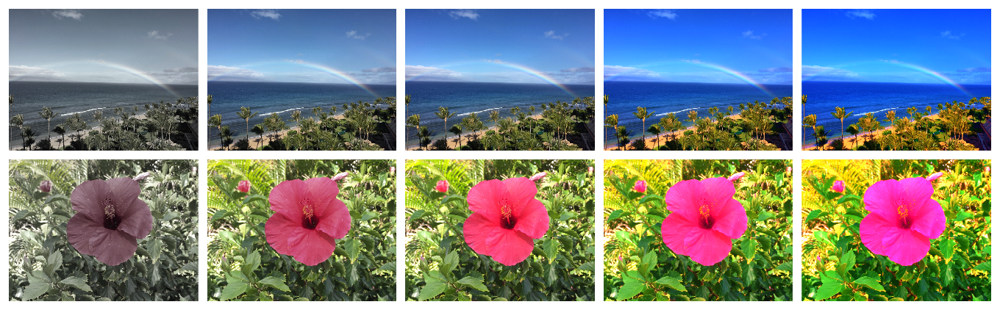
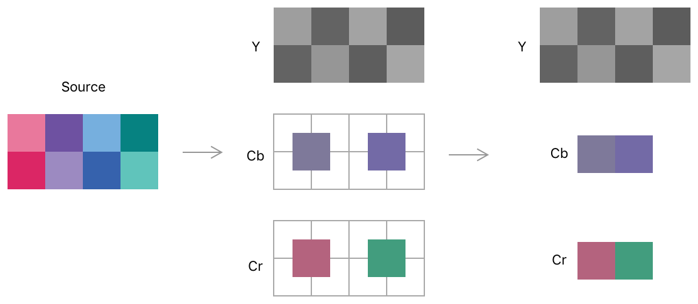
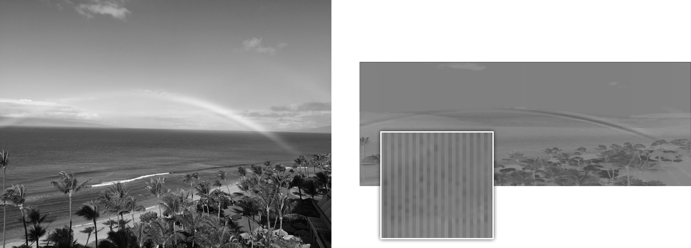
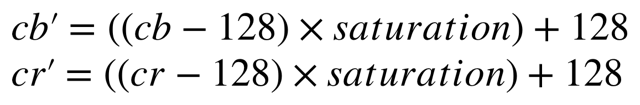
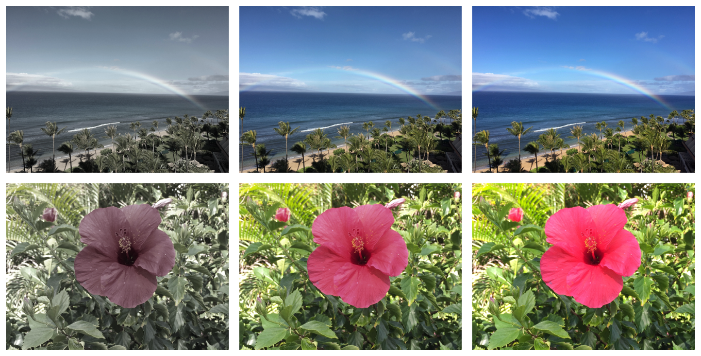
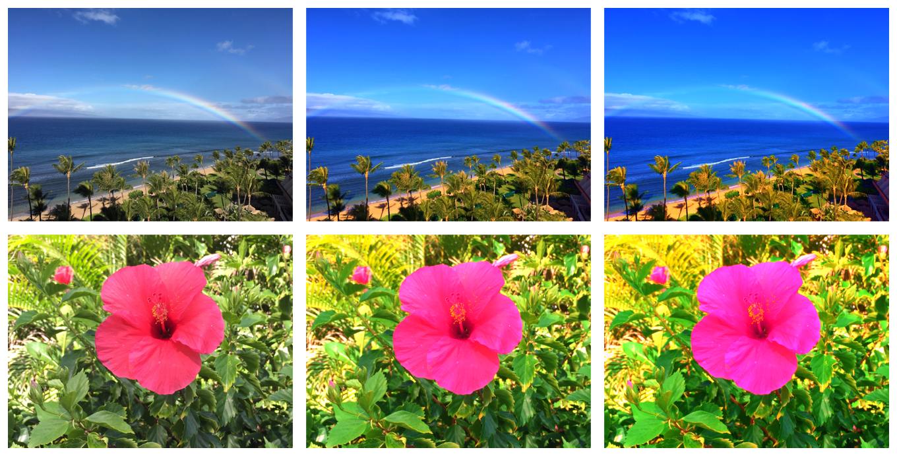
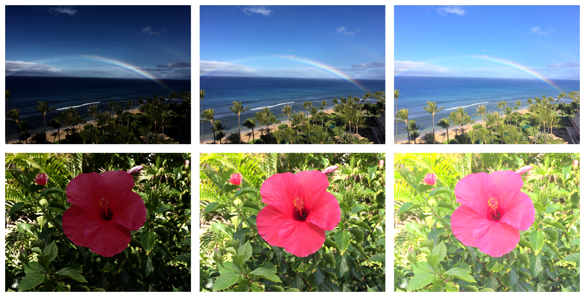

# Adjusting Saturation and Applying Tone Mapping

Convert an RGB image to discrete luminance and chrominance channels, and apply color and contrast treatments.

## Overview

This sample code project allows you to apply saturation adjustments to an image without affecting luminosity, and change the luminance response curve without affecting color. 

Many image processing techniques, such as saturation adjustment and tone mapping, are simpler to implement when you can work on an image's luminance data separately from its color data. This article explains how you can convert an RGB image—with its pixels represented as red, green, and blue values—to YCbCr, where luminance and chrominance are stored discretely. The _Y_ in YCbCr refers to the luminance, and the _Cb_ and _Cr_ refer to the blue-luminance difference, and red-luminance difference respectively.

This sample walks you through the following steps to adjust the saturation of an image, and then apply tone mapping to it:

1. Create a vImage buffer from a Core Graphics image.
2. Create source YCbCr buffers.
3. Define the RGB to YCbCr conversion.
4. Perform the RGB to YCbCr conversion.
5. Create destination YCbCr Buffers.
6. Apply saturation adjustment to the image.
7. Multiply CbCr values to decrease saturation.
8. Apply gamma to CbCr to increase saturation.
9. Apply gamma to luminance to apply tone mapping.
10. Define the YCbCr to RGB conversion.
11. Perform the YCbCr to RGB conversion.
12. Correct gamma before applying operations.

The following images show two photographs with a range of saturation adjustments, that illustrate the kinds of color changes you can make using the methods shown here.



## Create a vImage Buffer from a Core Graphics Image

Declare the vImage buffer, `argbSourceBuffer`, to store the source image, and use the `bufferFromImage(_:format:useLinear:)` function to populate it with the Core Graphics image:

``` swift
private var argbSourceBuffer: vImage_Buffer
```

``` swift
argbSourceBuffer = YCbCrAdjustment.bufferFromImage(sourceCGImage,
                                                   format: format,
                                                   useLinear: useLinear)
```

The `bufferFromImage(_:format:useLinear:)` function accepts a Boolean parameter to specify whether to remap the image from sRGB to linear: 

``` swift
static func bufferFromImage(_ cgImage: CGImage,
                            format: vImage_CGImageFormat,
                            useLinear: Bool) -> vImage_Buffer {
    guard
        var source = try? vImage_Buffer(cgImage: cgImage,
                                        format: format) else {
                                            fatalError("Unable to create source buffer.")
    }
    
    if useLinear {
        try? source.remap(.sRGBToLinear,
                          componentCount: format.componentCount)
    }
    
    return source
}
```

On return, `argbSourceBuffer` contains the image.

## Create Source YCbCr Buffers

The conversion routine used in this sample creates a YCbCr result with a chroma of 4:2:0; this means there is one Cb and one Cr pixel for every four luminance pixels. That is, each chrominance buffer is half of the width, and half of the height of the luminance channel. Reducing the resolution for the chrominance channels is known as _chroma subsampling_, and relies on the fact that human vision is less sensitive to color than luminance to reduce an image's size. 

The image below shows that a 4 x 2 image is represented by a 4 x 2 luminance channel, but each chrominance channel is 2 x 1 pixels:



To support the 4:2:0 YCbCr representation of the source image, create a luminance buffer that's the same size as the source buffer, but define the chrominance buffer's height as half the source height, and the width as the source width. This size enables the chrominance buffer to store both the Cb and Cr data as interleaved pixels.

``` swift
lazy private var ycbcrBuffers: (yp: vImage_Buffer, cbcr: vImage_Buffer) = {
    guard
        var ypSource = try? vImage_Buffer(width: width,
                                          height: height,
                                          bitsPerPixel: 8),
        var cbcrSource = try? vImage_Buffer(width: Int(argbSourceBuffer.width),
                                            height: Int(argbSourceBuffer.height / 2),
                                            bitsPerPixel: 8) else {
                                                fatalError("Unable to create YCbCr buffers.")
    }
    return (yp: ypSource, cbcr: cbcrSource)
}()
```

## Define the RGB to YCbCr Conversion

Create a [`vImage_YpCbCrPixelRange`](https://developer.apple.com/documentation/accelerate/vimage_ypcbcrpixelrange) structure that defines the range and clamping information for the destination YCbCr format. The destination buffer is 8-bit, so set the minimum and maximum values for luminance and chrominance to `0` and `255` respectively. `CbCr_bias` specifies the middle of the CbCr range (that is, where the blue-luminance difference or red-luminance difference is zero), so set that to 128:

``` swift
private var pixelRange = vImage_YpCbCrPixelRange(Yp_bias: 0,
                                                 CbCr_bias: 128,
                                                 YpRangeMax: 255,
                                                 CbCrRangeMax: 255,
                                                 YpMax: 255,
                                                 YpMin: 0,
                                                 CbCrMax: 255,
                                                 CbCrMin: 0)
```

Use [`vImageConvert_ARGBToYpCbCr_GenerateConversion`](https://developer.apple.com/documentation/accelerate/1533246-vimageconvert_argbtoypcbcr_gener)` to generate the conversion from ARGB to YpCbCr. In this sample, the conversion of RGB values is calculated using the conversion matrix for ITU Recommendation BT.709-2.

``` swift
private var argbToYpCbCr: vImage_ARGBToYpCbCr {
    var outInfo = vImage_ARGBToYpCbCr()
    
    vImageConvert_ARGBToYpCbCr_GenerateConversion(kvImage_ARGBToYpCbCrMatrix_ITU_R_709_2,
                                                  &pixelRange,
                                                  &outInfo,
                                                  kvImageARGB8888,
                                                  kvImage420Yp8_CbCr8,
                                                  vImage_Flags(kvImageNoFlags))
    return outInfo
}
```

## Perform the RGB to YCbCr Conversion

Use the [`vImageConvert_ARGB8888To420Yp8_CbCr8`](https://developer.apple.com/documentation/accelerate/1533164-vimageconvert_argb8888to420yp8_c) function to populate two vImage buffers—one containing luminance data, and one containing chrominance data—from the contents of a single ARGB buffer:

``` swift
func convertArgbToYpCbCr() {
    _ = withUnsafePointer(to: argbSourceBuffer) { src in
        withUnsafePointer(to: argbToYpCbCr) { info in
            vImageConvert_ARGB8888To420Yp8_CbCr8(src,
                                                 &ycbcrBuffers.yp,
                                                 &ycbcrBuffers.cbcr,
                                                 info,
                                                 [3, 2, 1, 0],
                                                 vImage_Flags(kvImagePrintDiagnosticsToConsole))
        }
    }
}
```

The following image shows the luminance result on the left, and the interleaved chrominance result on the right. Because the interleaved chrominance result contains both the Cb and Cr information, it's half the height of the luminance channel, but has the same width.



## Create Destination YCbCr Buffers

Before performing the image adjustments, create destination buffers to receive the processed result:

``` swift
private lazy var ypDestination: vImage_Buffer = {
    guard let buffer = try? vImage_Buffer(width: self.width,
                                          height: self.height,
                                          bitsPerPixel: 8) else {
                                            fatalError("Unable to create `ypDestination`.")
                                            
    }
    return buffer
}()

private lazy var cbcrDestination: vImage_Buffer = {
    guard let buffer = try? vImage_Buffer(width: self.width,
                                          height: self.height / 2,
                                          bitsPerPixel: 8) else {
                                            fatalError("Unable to create `cbcrDestination`.")
                                            
    }
    return buffer
}()
```

## Apply Saturation Adjustment to the Image

This sample uses two techniques to adjust saturation:

* Multiply CbCr values to decrease saturation.
* Apply gamma to CbCr to increase saturation

The tone mapping is performed by applying gamma to the luminance channel:

``` swift
if saturation > 1 {
    applyGammaToCbCr(gamma: 1 / saturation)
} else {
    applyLinearToCbCr(saturation: saturation)
}

applyGammaToLuma(lumaGamma: lumaGamma)
```

## Multiply CbCr Values to Decrease Saturation

You can easily adjust the color saturation of a YpCbCr image, without affecting its luminance, using the following formula:



You use the [`vImageMatrixMultiply_Planar8`](https://developer.apple.com/documentation/accelerate/1544331-vimagematrixmultiply_planar8) function to perform this math on the source chrominance buffer.

Pass the pre-bias (`–128`), and then multiply by the divisor both the post-bias (`+128`) and the saturation. The saturation is passed to the matrix multiply function as a single-element matrix, and the chrominance buffer is passed as the source and destination:

``` swift
private func applyLinearToCbCr(saturation: Float) {
    var preBias: Int16 = -128
    let divisor: Int32 = 0x1000
    var postBias: Int32 = 128 * divisor
    
    var matrix = [ Int16(saturation * Float(divisor)) ]
    
    withUnsafePointer(to: &cbcrDestination) { dest in
        withUnsafePointer(to: ycbcrBuffers.cbcr) { src in
            var sources: UnsafePointer<vImage_Buffer>? = src
            var destinations: UnsafePointer<vImage_Buffer>? = dest
            
            vImageMatrixMultiply_Planar8(&sources,
                                         &destinations,
                                         1,
                                         1,
                                         &matrix,
                                         divisor,
                                         &preBias,
                                         &postBias,
                                         vImage_Flags(kvImageNoFlags))
        }
    }
}
```

The following image shows two photographs, from left to right, with saturations of `0.25`, `0.75`, and `1.0` (that is, the rightmost image has an unchanged saturation).



## Apply Gamma to CbCr to Increase Saturation

The simple linear adjustment provided by [`vImageMatrixMultiply_Planar8`](https://developer.apple.com/documentation/accelerate/1544331-vimagematrixmultiply_planar8) is fine for desaturating an image, however, when increasing saturation, the CbCr values can clip, leading to areas of solid color. An alternative technique to increase saturation is to apply an exponential adjustment. Use [`vImageGamma_PlanarF`](https://developer.apple.com/documentation/accelerate/1546983-vimagegamma_planarf) to apply a gamma value to the CbCr values to increase saturation.

The `YCbCrAdjustment.applyGammaToCbCr(gamma:)` function applies a gamma value to the chrominance buffer with the following steps:

1. Use [`vImageCreateGammaFunction`](https://developer.apple.com/documentation/accelerate/1545896-vimagecreategammafunction) to create a gamma function object, defining its gamma as the reciprocal of the desired saturation.
2. Populate the gamma destination buffer with the contents of the CbCr buffer. Pass a `maxFloat` value of `1`, and a `minFloat` value of `-1` to remap the `UInt8` CbCr values from `0...255` to `-1...1`.
3. Use [`vImageGamma_PlanarF`](https://developer.apple.com/documentation/accelerate/1546983-vimagegamma_planarf) to apply the gamma function to the buffer, and overwrite the CbCr buffer with the gamma adjusted values.

``` swift
private func applyGammaToCbCr(gamma: Float) {
    let gammaFunction = vImageCreateGammaFunction(gamma,
                                                  Int32(kvImageGamma_UseGammaValue),
                                                  vImage_Flags(kvImageNoFlags))
    defer {
        vImageDestroyGammaFunction(gammaFunction)
    }
    
    _ = withUnsafePointer(to: ycbcrBuffers.cbcr) { cbcrSource in
        vImageConvert_Planar8toPlanarF(cbcrSource,
                                       &gammaDestination,
                                       1, -1,
                                       vImage_Flags(kvImageNoFlags))
    }
    
    vImageGamma_PlanarF(&gammaDestination,
                        &gammaDestination,
                        gammaFunction,
                        0)
    
    vImageConvert_PlanarFtoPlanar8(&gammaDestination,
                                   &cbcrDestination,
                                   1, -1,
                                   vImage_Flags(kvImageNoFlags))
}
```

The following image shows two photographs, from left to right, with a saturation of 1.0 (that is, the leftmost image has an unchanged saturation), 1.5, and 2.0.



When decreasing the saturation, the gamma function is not appropriate because pixels with very saturated color will desaturate very little, or not at all.

## Apply Gamma to Luminance to Apply Tone Mapping

You can adjust the contrast of an image, with a technique known as tone mapping, by applying a gamma adjustment to the luminance channel.

Adjusting contrast is discussed in [Adjusting the Brightness and Contrast of an Image](https://developer.apple.com/documentation/accelerate/adjusting_the_brightness_and_contrast_of_an_image), however applying a gamma adjustment to red, green, and blue channels changes both the color and tonal values.

The `ypDestination` buffer, that contains the luminance data, is a planar buffer and can be operated on by [`vImagePiecewiseGamma_Planar8`](https://developer.apple.com/documentation/accelerate/1546371-vimagepiecewisegamma_planar8). 

``` swift
private func applyGammaToLuma(lumaGamma: Float) {
    _ = withUnsafePointer(to: ycbcrBuffers.yp) { src in
        vImagePiecewiseGamma_Planar8(src,
                                     &ypDestination,
                                     [1, 0, 0],
                                     lumaGamma,
                                     [1, 0],
                                     0,
                                     vImage_Flags(kvImageNoFlags))
    }
}
```

The following image shows two photographs, from left to right, with a gamma applied to the luminance channel of 2.5, 0.0 (that is, the center image is unchanged), and 0.5.



## Define the YCbCr to RGB Conversion

Once you've completed working on the YCbCr representation, convert the YCbCr data to RGB. The process is very similar to the RGB to YCbCr conversion and uses the same pixel range, but the conversion generated by the [`vImageConvert_YpCbCrToARGB_GenerateConversion`](https://developer.apple.com/documentation/accelerate/1533189-vimageconvert_ypcbcrtoargb_gener) function:

``` swift
private var ypCbCrToARGB: vImage_YpCbCrToARGB {
    var outInfo = vImage_YpCbCrToARGB()
    
    vImageConvert_YpCbCrToARGB_GenerateConversion(kvImage_YpCbCrToARGBMatrix_ITU_R_709_2,
                                                  &pixelRange,
                                                  &outInfo,
                                                  kvImage420Yp8_CbCr8,
                                                  kvImageARGB8888,
                                                  vImage_Flags(kvImageNoFlags))
    
    return outInfo
}
```

## Perform the YCbCr to RGB Conversion

Create a buffer to recieve the YCbCr to RGB conversion result:

``` swift
private lazy var argbDestination: vImage_Buffer = {
    guard let buffer = try? vImage_Buffer(width: self.width,
                                          height: self.height,
                                          bitsPerPixel: 32) else {
                                            fatalError("Unable to create `argbDestination`.")
                                            
    }
    return buffer
}()
```

Perform the conversion using [`vImageConvert_420Yp8_CbCr8ToARGB8888`](vImageConvert_420Yp8_CbCr8ToARGB8888):

``` swift
_ = withUnsafePointer(to: ypCbCrToARGB) { info in
    vImageConvert_420Yp8_CbCr8ToARGB8888(&ypDestination,
                                         &cbcrDestination,
                                         &argbDestination,
                                         info,
                                         [3, 2, 1, 0],
                                         255,
                                         vImage_Flags(kvImagePrintDiagnosticsToConsole))
}
```

On return, `argbDestination` contains the processed image in RGB color space.

## Correct Gamma Before Applying Operations

Many vImage operations provide optimal results when working on images with a linear response curve. If you are working with nonlinear images—such as sRGB—consider converting them to a linear color space by applying a reciprocal gamma, performing the operation, and converting them back to their original domain by applying the original gamma.

vImage provides predefined gamma functions for converting from linear to sRGB, and from sRGB to linear. The following function is implemented as an extension to [`vImage_Buffer`](vImage_Buffer) and remaps a buffer's contents in-place in the specified direction:

``` swift
extension vImage_Buffer {
    
    enum Remap {
        case linearToSRGB
        case sRGBToLinear
        
        var gammaType: Int32 {
            let gammaType: Int
            
            switch self {
                case .linearToSRGB:
                    gammaType = kvImageGamma_sRGB_forward_half_precision
                case .sRGBToLinear:
                    gammaType = kvImageGamma_sRGB_reverse_half_precision
            }
            return Int32(gammaType)
        }
    }

    mutating func remap(_ remap: Remap, componentCount: Int) throws {
```

Use [`vImageCreateGammaFunction`](https://developer.apple.com/documentation/accelerate/1545896-vimagecreategammafunction) to create a [`GammaFunction`](https://developer.apple.com/documentation/accelerate/gammafunction) based on the predefined gamma value: 

``` swift
let gammaFunction = vImageCreateGammaFunction(0,
                                              remap.gammaType,
                                              vImage_Flags(kvImageNoFlags))
defer {
    vImageDestroyGammaFunction(gammaFunction)
}
```

Create a 32-bit-per-component buffer to receive the gamma result: 

``` swift
guard
    let floatBuffer = try? vImage_Buffer(width: Int(self.width),
                                         height: Int(self.height),
                                         bitsPerPixel: 32 * UInt32(componentCount)) else {
                                            throw vImage.Error(vImageError: kvImageInternalError)
}

defer {
    floatBuffer.free()
}
```

Create planar buffers that reference the interleaved buffers:

``` swift
var planarBuffer = vImage_Buffer(data: self.data,
                                 height: self.height,
                                 width: self.width * UInt(componentCount),
                                 rowBytes: self.rowBytes)

var planarFloatBuffer = vImage_Buffer(data: floatBuffer.data,
                                      height: floatBuffer.height,
                                      width: floatBuffer.width * UInt(componentCount),
                                      rowBytes: floatBuffer.rowBytes)
```

Convert to 8-bit source data to single-precision values and remap from `0...255` to `0...1`:

``` swift
var error = kvImageNoError

error = vImageConvert_Planar8toPlanarF(&planarBuffer,
                                       &planarFloatBuffer,
                                       1, 0,
                                       vImage_Flags(kvImageNoFlags))

if error != kvImageNoError {
    throw vImage.Error(vImageError: error)
}
```

Perform the gamma correction on the single-precision planar buffer:

``` swift
error = vImageGamma_PlanarF(&planarFloatBuffer,
                            &planarFloatBuffer,
                            gammaFunction,
                            vImage_Flags(kvImageNoFlags))

if error != kvImageNoError {
    throw vImage.Error(vImageError: error)
}
```

Finally, convert the gamma corrected single-precision values back to `UInt8`, overwriting the contents of the source buffer:

``` swift
        error = vImageConvert_PlanarFtoPlanar8(&planarFloatBuffer,
                                               &planarBuffer,
                                               1, 0,
                                               vImage_Flags(kvImageNoFlags))
        
        if error != kvImageNoError {
            throw vImage.Error(vImageError: error)
        }
    }
}
```
