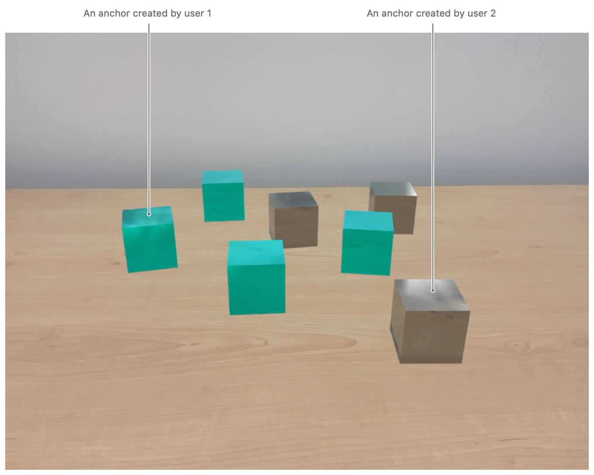
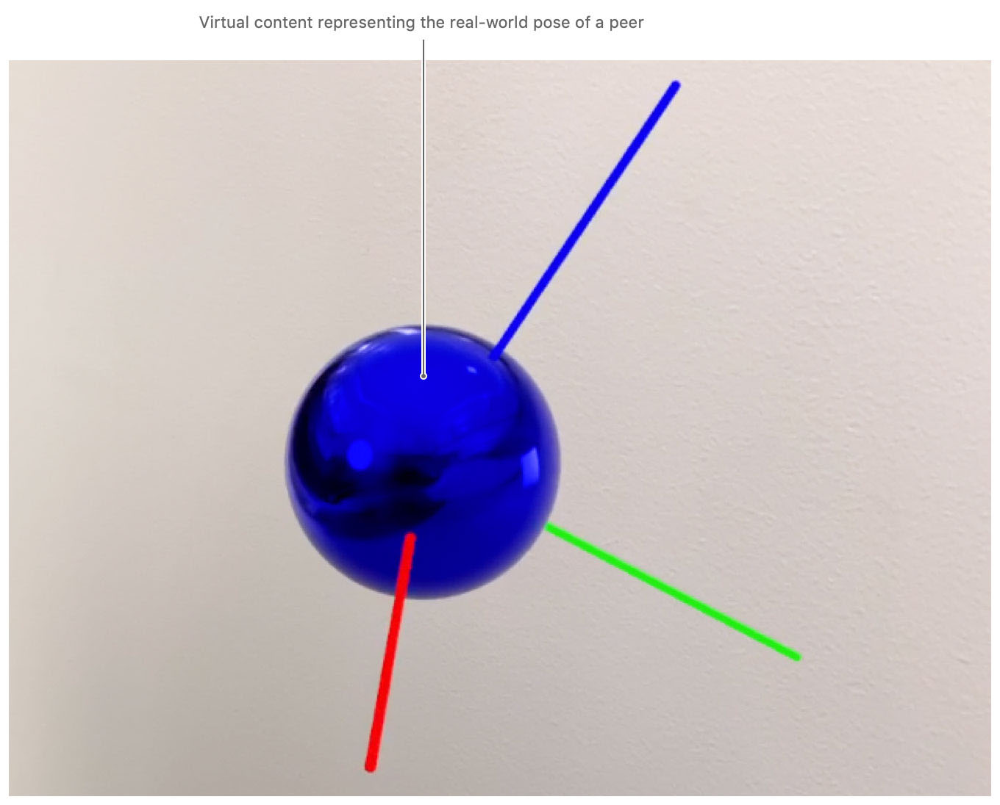
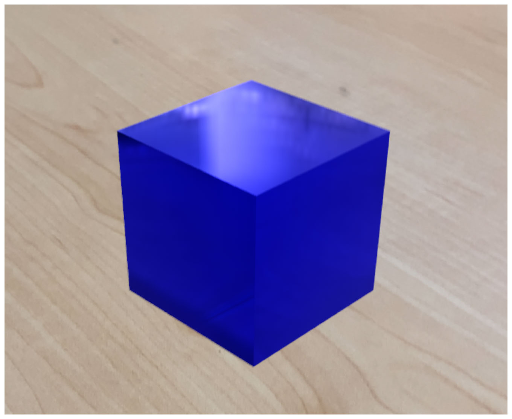

# Creating a Collaborative Session
 
Enable nearby devices to share an AR experience by using a peer-to-peer multiuser strategy. 
 
 ## Overview
 
As an AR app runs, ARKit gathers information about a userʼs physical environment by processing the camera feed from the user’s device. To effect a multiuser AR experience in which users learn more about the environment by sharing the information from their device’s camera feed with other users, you enable *collaboration*. 

Throughout a collaborative session, ARKit periodically provides data for you to share with peer users, and you choose a network protocol to send that data. In addition to information about the layout of the physical environment––the *world data*––collaboration data includes an anchor for each participant. These anchors indicate each peer's approximate location, which you can use, for example, to place virtual content that represents the peer user. ARKit also provides you with any anchors that the peer users create themselves.

This sample app allows multiple users to view a common horizontal surface and place blocks on top of the surface, with a unique color for each user.

 

Although this sample draws its graphics using RealityKit, it doesn't use RealityKit's mechanism for over-the-network entity synchronization. Instead, it uses RealityKit as a renderer only as necessary to demonstrate ARKit's collaborative session.   
 
To create a shared AR experience using a host-guest approach, see [Creating a Multiuser AR Experience][1]. 
 
## Enable Collaboration

Collaborative sessions are available when your session uses [`ARWorldTrackingConfiguration`][12]. To enable collaboration, set [`isCollaborationEnabled`][2] to `true`.

``` swift
configuration = ARWorldTrackingConfiguration()

// Enable a collaborative session.
configuration?.isCollaborationEnabled = true

// Enable realistic reflections.
configuration?.environmentTexturing = .automatic

// Begin the session.
arView.session.run(configuration!)
```

## Gather Collaboration Data

When collaboration is enabled, ARKit periodically invokes [`session(_:didOutputCollaborationData:)`][3], which provides collaboration data that you can share with nearby users. You are responsible for sending collaboration data over the network, including choosing the network framework and implementing the code. The data you send is a serialized version of the [`ARSession.CollaborationData`][5] object provided by your session. Before you send collaboration data over the network, first serialize it using [`NSKeyedArchiver`][6].

``` swift
func session(_ session: ARSession, didOutputCollaborationData data: ARSession.CollaborationData) {
    guard let multipeerSession = multipeerSession else { return }
    if !multipeerSession.connectedPeers.isEmpty {
        guard let encodedData = try? NSKeyedArchiver.archivedData(withRootObject: data, requiringSecureCoding: true)
        else { fatalError("Unexpectedly failed to encode collaboration data.") }
        // Use reliable mode if the data is critical, and unreliable mode if the data is optional.
        let dataIsCritical = data.priority == .critical
        multipeerSession.sendToAllPeers(encodedData, reliably: dataIsCritical)
    } else {
        print("Deferred sending collaboration to later because there are no peers.")
    }
}
```
[View in Source](x-source-tag://DidOutputCollaborationData)

It's safe to ignore the collaboration data if no peers have joined the session. In that case, ARKit outputs the collaboration data later to try again. The alternative approach of enabling collaboration only after peers have joined is not supported, because doing so restarts the session. 

## Send Collaboration Data to Others

You choose the network protocol with which to share collaboration data. This sample app sends collaboration data using [MultipeerConnectivity][4]. 

``` swift
func sendToPeers(_ data: Data, reliably: Bool, peers: [MCPeerID]) {
    guard !peers.isEmpty else { return }
    do {
        try session.send(data, toPeers: peers, with: reliably ? .reliable : .unreliable)
    } catch {
        print("error sending data to peers \(peers): \(error.localizedDescription)")
    }
}
```
[View in Source](x-source-tag://SendToPeers)

## Update Your Session with Collaboration Data 

When you receive collaboration data from peer users, you instantiate an [`ARSession.CollaborationData`][5] object with it, and pass the object to your session via [`update(with:)`][7].

``` swift
func receivedData(_ data: Data, from peer: MCPeerID) {
    if let collaborationData = try? NSKeyedUnarchiver.unarchivedObject(ofClass: ARSession.CollaborationData.self, from: data) {
        arView.session.update(with: collaborationData)
        return
    }
    // ...
```

## Facilitate World Map Merging

For ARKit to know where two users are with respect to each other, it has to recognize overlap across their respective world maps. When ARKit succeeds in fitting the two world maps together, it can begin sharing those users' respective locations and any anchors they created with each other. 

To aid ARKit with world map merging, a user must point their device near an area that another user has viewed. The sample app accomplishes this by asking the users to hold their devices side by side.

``` swift
messageLabel.displayMessage("""
    A peer wants to join the experience.
    Hold the phones next to each other.
    """, duration: 6.0)
```

## Identify when ARKit Merges World Data

The first time ARKit successfully merges world data from another user, it calls your app's [`session(_:didAdd:)`][8], passing in an [`ARParticipantAnchor`][9] that identifies the other user. This action notifies you of the merging event.

``` swift
func session(_ session: ARSession, didAdd anchors: [ARAnchor]) {
    for anchor in anchors {
        if let participantAnchor = anchor as? ARParticipantAnchor {
            messageLabel.displayMessage("Established joint experience with a peer.")
            // ...
```

## Visualize Users by Displaying Virtual Content

When ARKit successfully merges two users' world data, you can then initiate actions to begin the multiuser experience. The sample adds virtual content in the real-world location of newly joined peer users to visualize them in AR.

``` swift
let anchorEntity = AnchorEntity(anchor: participantAnchor)

let coordinateSystem = MeshResource.generateCoordinateSystemAxes()
anchorEntity.addChild(coordinateSystem)

let color = participantAnchor.sessionIdentifier?.toRandomColor() ?? .white
let coloredSphere = ModelEntity(mesh: MeshResource.generateSphere(radius: 0.03),
                                materials: [SimpleMaterial(color: color, isMetallic: true)])
anchorEntity.addChild(coloredSphere)

arView.scene.addAnchor(anchorEntity)
```

The multicolored coordinate system shown in the following illustration represents the real-world pose of a peer user. ARKit periodically refreshes participant anchors to reflect any updates in the real-world location and orientation of the user it tracks. This process is a part of the collaboration data your app shares and uses to update its session.      



## Check an Anchor's Owner

When ARKit merges two users' world data, it collects all the anchors created by both users and calls [`session(_:didAdd:)`][8] to notify each user of the collection. To check which user created an anchor, you compare the anchor's [`sessionIdentifier`][10] with the active session's [`identifier`][11]. If the anchor's session ID is different from the active session's ID, the other user created the anchor.

## Color Virtual Content Based on the User

To distinguish virtual content by user, you choose a different color for each user. The sample app uses the [`toRandomColor`](x-source-tag://ToRandomColor) function to assign user colors.  

``` swift
let color = anchor.sessionIdentifier?.toRandomColor() ?? .white
```

The random color function works by applying a modulo operation to the anchor's session ID, and interpreting the result as an index into a color array.

``` swift
func toRandomColor() -> UIColor {
    var firstFourUUIDBytesAsUInt32: UInt32 = 0
    let data = withUnsafePointer(to: self) {
        return Data(bytes: $0, count: MemoryLayout.size(ofValue: self))
    }
    _ = withUnsafeMutableBytes(of: &firstFourUUIDBytesAsUInt32, { data.copyBytes(to: $0) })

    let colors: [UIColor] = [.red, .green, .blue, .yellow, .magenta, .cyan, .purple,
    .orange, .brown, .lightGray, .gray, .darkGray, .black, .white]
    
    let randomNumber = Int(firstFourUUIDBytesAsUInt32) % colors.count
    return colors[randomNumber]
}
```
[View in Source](x-source-tag://ToRandomColor)

## Place Virtual Content

When ARKit notifies you of a new nonparticipant anchor in [`session(_:didAdd:)`][8], place a block geometry tinted with the color calculated in the previous section.     

``` swift
let coloredCube = ModelEntity(mesh: MeshResource.generateBox(size: boxLength),
                              materials: [SimpleMaterial(color: color, isMetallic: true)])
// Offset the cube by half its length to align its bottom with the real-world surface.
coloredCube.position = [0, boxLength / 2, 0]

// Attach the cube to the ARAnchor via an AnchorEntity.
//   World origin -> ARAnchor -> AnchorEntity -> ModelEntity
let anchorEntity = AnchorEntity(anchor: anchor)
anchorEntity.addChild(coloredCube)
arView.scene.addAnchor(anchorEntity)
```



The sample app uses common ARKit techniques to place virtual objects. For more information about mapping screen touches to real-world locations, see [Placing Objects and Handling 3D Interaction][13].

[1]:https://developer.apple.com/documentation/arkit/creating_a_multiuser_ar_experience
[2]:https://developer.apple.com/documentation/arkit/arworldtrackingconfiguration/3152987-iscollaborationenabled
[3]:https://developer.apple.com/documentation/arkit/arsessionobserver/3152999-session
[4]:https://developer.apple.com/documentation/multipeerconnectivity
[5]:https://developer.apple.com/documentation/arkit/arsession/collaborationdata
[6]:https://developer.apple.com/documentation/foundation/nskeyedarchiver
[7]:https://developer.apple.com/documentation/arkit/arsession/3214029-update
[8]:https://developer.apple.com/documentation/arkit/arsessiondelegate/2865617-session
[9]:https://developer.apple.com/documentation/arkit/arparticipantanchor
[10]:https://developer.apple.com/documentation/arkit/aranchor/3214025-sessionidentifier
[11]:https://developer.apple.com/documentation/arkit/arsession/3214028-identifier
[12]:https://developer.apple.com/documentation/arkit/arworldtrackingconfiguration
[13]:https://developer.apple.com/documentation/arkit/world_tracking/placing_objects_and_handling_3d_interaction
