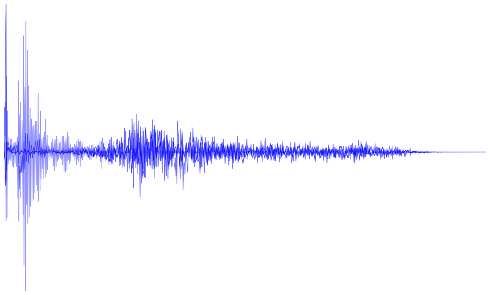
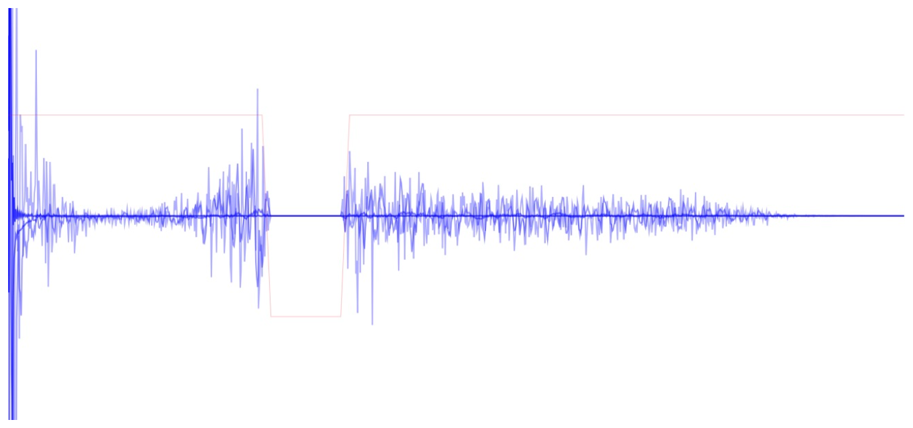

# Equalizing Audio with vDSP

Shape audio output using discrete cosine transforms and biquadratic filters.

## Overview

You can use vDSP functions to change the frequency response of an audio signal; for example, boosting or cutting the bass or treble of a music track. 

This sample plays a drum loop and offers a range of equalization presets using two approaches:

* Discrete cosine transform-based (DCT) equalizations that explicitly zero specific parts of the audio spectrum.
* Biquadratic filter-based equalizations that use a set of coefficients to change the frequency response based on the ratio of two quadratic functions.  

When you first launch the app, the drum loop plays without any filters applied. The app displays the frequency domain representation of the drum loop, illustrated below, and a segmented control that switches between the equalization presets.



Before exploring the code, try building and running the app to familiarize yourself with the effect of the different equalizations on the drum loop.

## Generate the Audio Samples

This sample includes an audio resource, `Rhythm.aif`, that contains a drum loop. Use the `getAudioSamples(forResource:withExtension:)` function to generate an array of single-precision values from the drum loop:

``` swift
let samples: [Float] = {
    guard let samples = AudioUtilities.getAudioSamples(
        forResource: "Rhythm",
        withExtension: "aif") else {
            fatalError("Unable to parse the audio resource.")
    }
    
    return samples
}()
```

The `samples` array contains single-precision values that represent the entire content of `Rhythm.aif`. To learn more about the [AVFoundation](https://developer.apple.com/documentation/avfoundation) classes used to generate the samples, see [`AVAssetReader`](https://developer.apple.com/documentation/avfoundation/avassetreader) and [`AVAssetReaderTrackOutput`](https://developer.apple.com/documentation/avfoundation/avassetreadertrackoutput).

## Configure Audio Playback

The sample app's view controller conforms to the `SignalProvider` protocol by vending an array of single-precision values that represent audio data. Use the `configureAudioUnit(signalProvider:)` function to define the sample app's view controller as a signal provider for audio playback:

``` swift
AudioUtilities.configureAudioUnit(signalProvider: self)
```

On return, the configured audio unit's output provider repeatedly calls the `getSignal()` function and renders the returned data as audio. For each call, return a page of length `sampleCount`  from `samples`:

``` swift
let start = pageNumber * sampleCount
let end = (pageNumber + 1) * sampleCount

let page = Array(samples[start ..< end])

pageNumber += 1

if (pageNumber + 1) * sampleCount >= samples.count {
    pageNumber = 0
}
```
    
You can render the audio unaltered by returning `page`.

To learn more about using [AudioToolbox](https://developer.apple.com/documentation/audiotoolbox) to render audio, see [`AUAudioUnit`](https://developer.apple.com/documentation/audiotoolbox/auaudiounit).

## Define DCT-Based Equalization Filters

The sample includes four DCT-based equalization presets:

* Low-Pass blocks high frequencies (treble).
* High-Pass blocks low frequencies (bass).
* Band-Stop blocks mid-range frequencies.
* Band-Pass only allows mid-range frequencies.

The sample implements the presets as arrays of single-precision values between zero and one. To apply the equalization, multiply the frequency-domain data by the values in each preset array. For example, the following code creates the band-stop filter by returning an array mainly filled with ones, apart from elements 300-380 that are filled with zeros. 

``` swift
static let dctBandStop: [Float] = {
    return interpolatedVectorFrom(magnitudes:  [1,   1,   0,   0,   1,    1],
                                  indices:     [0, 290, 300, 380, 390, 1024],
                                  count: sampleCount)
}()

static func interpolatedVectorFrom(magnitudes: [Float],
                                   indices: [Float],
                                   count: Int) -> [Float] {
    assert(magnitudes.count == indices.count,
           "`magnitudes.count` must equal `indices.count`.")
    
    var c = [Float](repeating: 0,
                    count: count)
    
    let stride = vDSP_Stride(1)
    
    vDSP_vgenp(magnitudes, stride,
               indices, stride,
               &c, stride,
               vDSP_Length(count),
               vDSP_Length(magnitudes.count))
    
    return c
}
```

The following image visualizes the effect of the band-stop filter. The darker, blue line represents the frequency-domain audio data, and the lighter red line represents the values in the band-stop filter: 



## Prepare the DCT Setups

Create setup objects that contain all the information required to perform the forward and inverse DCT operations. Creating these setup objects can be expensive, so do it only once—for example, when starting your app—and reuse the objects as needed.

The forward transform is a type II DCT:

``` swift
let forwardDCT = vDSP.DCT(count: sampleCount,
                          transformType: .II)
```
    
The inverse transform is a type III DCT:

``` swift
let inverseDCT = vDSP.DCT(count: sampleCount,
                          transformType: .III)
```

## Equalize the Audio with DCT

To equalize the audio using a DCT-based filter, do the following:

* Apply a forward transform to the signal data (time-domain). This generates the frequency-domain representation.
* Multiply the frequency-domain by the filter values.
* Finally, apply an inverse transform to the multiplied data. This generates the time-domain representation.

``` swift
func apply(dctMultiplier: [Float], toInput input: [Float]) -> [Float] {
    // Perform forward DCT.
    forwardDCT?.transform(input,
                          result: &forwardDCT_PreProcessed)
    // Multiply frequency-domain data by `dctMultiplier`.
    vDSP.multiply(dctMultiplier,
                  forwardDCT_PreProcessed,
                  result: &forwardDCT_PostProcessed)
    
    // Perform inverse DCT.
    inverseDCT?.transform(forwardDCT_PostProcessed,
                          result: &inverseDCT_Result)
```

Finally, scale the result. The scaling factor for the forward transform is `2`, and the scaling factor for the inverse transform is the number of samples (in this case, `1024`). Use [`divide(_:_:)`](https://developer.apple.com/documentation/accelerate/vdsp/3240936-divide) to divide the inverse DCT result by `sampleCount / 2`, and return the result of the divide operation:

``` swift
vDSP.divide(inverseDCT_Result,
            Float(sampleCount / 2),
            result: &inverseDCT_Result)
```
    
By passing the values in `page` to this equalization function, and having `getSignal()` return the function's result, the app applies the DCT-based filter when playing the drum loop.

## Declare the Biquad Structure

Declare a structure to apply biquadratic filtering:

``` swift
var biquadFilter: vDSP.Biquad<Float>?
```

## Define Biquadratic-Based Equalization Filters

The sample includes two biquadratic-based equalization presets:

* Low-Pass blocks high frequencies (treble).
* High-Pass blocks low frequencies (bass).

Define a biquadratic filter by declaring a set of coefficients that plug in to the following formula:


The following code defines the coefficients for a low-pass filter (that reduces high frequencies):

``` swift
static let biquadLowPass: [Double] = {
    let b0 = 0.0001
    let b1 = 0.001
    let b2 = 0.0005
    let a1 = -1.979
    let a2 = 0.98

    return [b0, b1, b2, a1, a2]
}()
```

When either the low- or high-pass biquad filter is selected, the corresponding coefficients are used to instantiate `biquadFilter`:

``` swift
switch mode {
case .biquadLowPass:
    biquadFilter = vDSP.Biquad(coefficients: EqualizationFilters.biquadLowPass,
                               channelCount: 1,
                               sectionCount: 1,
                               ofType: Float.self)
case .biquadHighPass:
    biquadFilter = vDSP.Biquad(coefficients: EqualizationFilters.biquadHighPass,
                               channelCount: 1,
                               sectionCount: 1,
                               ofType: Float.self)
default:
    break
}
```
    
## Equalize the Audio with Biquadratic Filters

Use the [`apply(input:)`](https://developer.apple.com/documentation/accelerate/vdsp/biquad/3240705-apply) function to apply biquadratic filtering structure to the audio signal based on the selected coefficients (such as `biquadLowPass` defined earlier):

``` swift
func apply(toInput input: [Float]) -> [Float] {
    return biquadFilter!.apply(input: input)
}
```

By passing the values in `page` to this equalization function, and having `getSignal()` return the function's result, the app plays the drum loop with the biquadratic-based filter applied.
