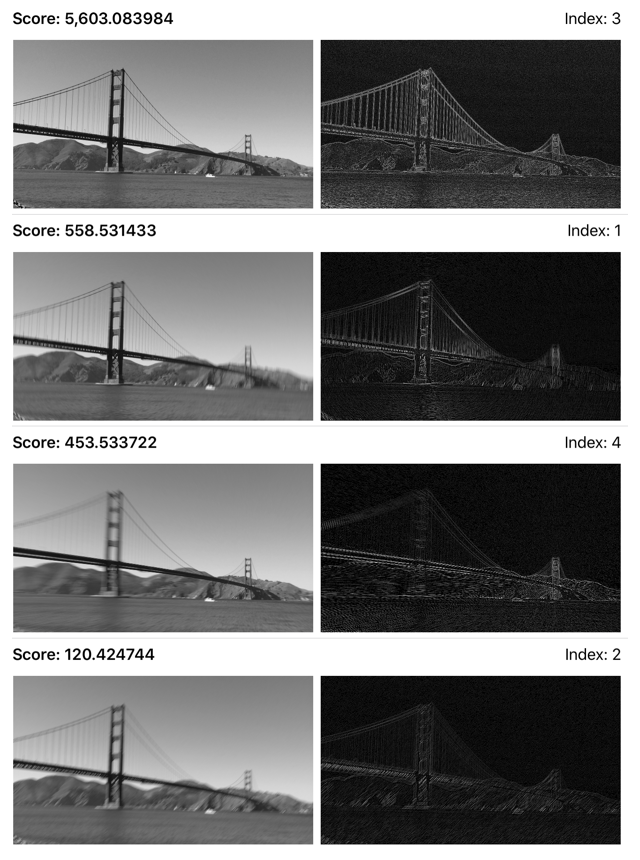
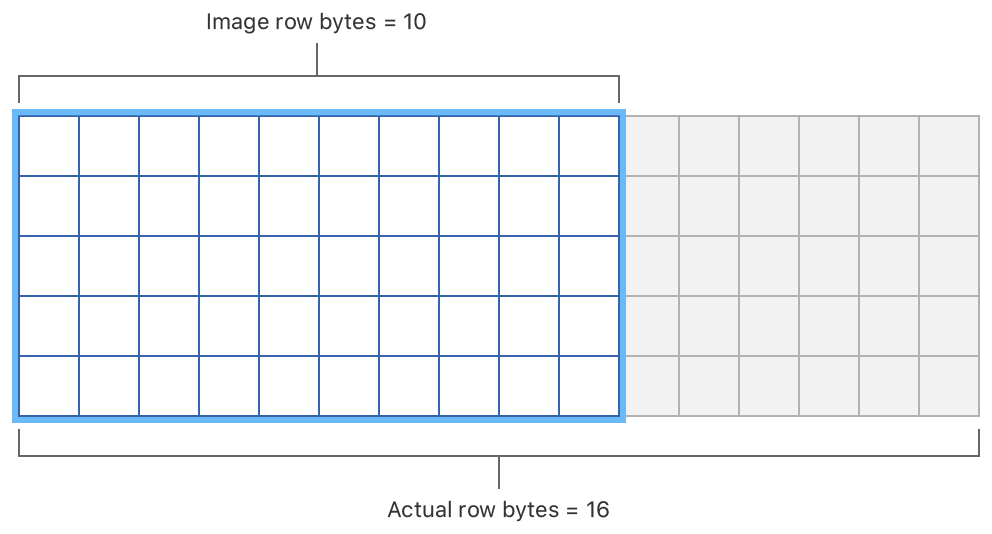
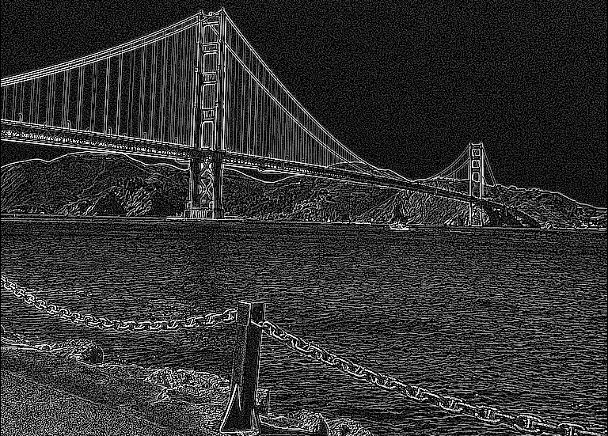

# Finding the Sharpest Image in a Sequence of Captured Images

Share image data between vDSP and vImage to compute the sharpest image from a bracketed photo sequence.

## Overview

This sample code project captures a sequence of photographs and uses a combination of routines from vImage and vDSP to order the images by their relative sharpness. This technique is useful in applications such as an image scanner, where your user requires the least blurry captured image. After applying the routines, the app displays the images in a list, with the sharpest image at the top:



This project uses [SwiftUI](https://developer.apple.com/documentation/swiftui) to build the user interface;  [AVFoundation](https://developer.apple.com/documentation/avfoundation) to capture a sequence of images; and a method known as the _variance of Laplacian_ to determine the sharpness of each image. 

This sample walks you through the steps to find the sharpest image in a sequence of captured images:

1. Configure the capture session.
2. Define the photo settings for the sequence of captured images.
3. Acquire the images.
4. Initialize the grayscale vImage buffer.
5. Create floating point pixels to use in vDSP.
6. Convolve the image using a 3 x 3 single-pass edge detection Laplacian kernel (the result of this convolution pass is also shown in the app's user interface).
7. Calculate the variance, or how spread out the pixel values are, in the convolved image.
8. Create a vImage buffer from the vDSP convolution result.
9. Create a display image with correct orientation.

## Configure the Capture Session

The 3 x 3 Laplacian kernel used in this sample will report a lot of noise if applied to a full-resolution image. To reduce this noise, use a downscaled image by defining the capture session's preset to a size that's smaller than the camera's native resolution:

``` swift
captureSession.sessionPreset = .hd1280x720
```

To learn more about configuring a capture session, see [Setting Up a Capture Session](https://developer.apple.com/documentation/avfoundation/cameras_and_media_capture/setting_up_a_capture_session).

## Define the Photo Settings

The sample defines the [`AVCapturePhotoBracketSettings`](https://developer.apple.com/documentation/avfoundation/avcapturephotobracketsettings) object, that specifies the capture features and settings, in `BlurDetector.takePhoto()`.

The sharpness detection algorithm in this sample works on a grayscale image. Use one of the camera's YpCbCr pixel formats, either [`kCVPixelFormatType_420YpCbCr8BiPlanarVideoRange`](https://developer.apple.com/documentation/corevideo/1563591-pixel_format_identifiers/kcvpixelformattype_420ypcbcr8biplanarvideorange) or [`kCVPixelFormatType_420YpCbCr8BiPlanarFullRange`](https://developer.apple.com/documentation/corevideo/1563591-pixel_format_identifiers/kcvpixelformattype_420ypcbcr8biplanarfullrange). These formats represent the luminance of the image using one plane, and color information on separate planes. 

The following code checks that the current device supports one or both of these formats: 

``` swift
let pixelFormat: FourCharCode = {
    if photoOutput.availablePhotoPixelFormatTypes
        .contains(kCVPixelFormatType_420YpCbCr8BiPlanarFullRange) {
        return kCVPixelFormatType_420YpCbCr8BiPlanarFullRange
    } else if photoOutput.availablePhotoPixelFormatTypes
        .contains(kCVPixelFormatType_420YpCbCr8BiPlanarVideoRange) {
        return kCVPixelFormatType_420YpCbCr8BiPlanarVideoRange
    } else {
        fatalError("No available YpCbCr formats.")
    }
}()
```

Create an array of [`AVCaptureAutoExposureBracketedStillImageSettings`](https://developer.apple.com/documentation/avfoundation/avcaptureautoexposurebracketedstillimagesettings) instances and define the exposure target bias of each to [`currentExposureTargetBias`](https://developer.apple.com/documentation/avfoundation/avcapturedevice/1624621-currentexposuretargetbias). The maximum number of items in the array is defined by the [`maxBracketedCapturePhotoCount`](https://developer.apple.com/documentation/avfoundation/avcapturephotooutput/1648702-maxbracketedcapturephotocount?language=objc) property of the [`AVCapturePhotoOutput`](https://developer.apple.com/documentation/avfoundation/avcapturephotooutput) object:

``` swift
let exposureSettings = (0 ..< photoOutput.maxBracketedCapturePhotoCount).map { _ in
    AVCaptureAutoExposureBracketedStillImageSettings.autoExposureSettings(
        exposureTargetBias: AVCaptureDevice.currentExposureTargetBias)
}
```

Use the array of exposure settings and the first available YpCbCr format type to define the bracketed settings:

``` swift
let photoSettings = AVCapturePhotoBracketSettings(
    rawPixelFormatType: 0,
    processedFormat: [kCVPixelBufferPixelFormatTypeKey as String: pixelFormat],
    bracketedSettings: exposureSettings)
```

Use the `AVCapturePhotoBracketSettings` instance to capture the sequence of images:

``` swift
photoOutput.capturePhoto(with: photoSettings,
                         delegate: self)
```

## Acquire the Captured Image

For each captured image, AVFoundation calls the [`photoOutput(_:didFinishProcessingPhoto:error:)`](https://developer.apple.com/documentation/avfoundation/avcapturephotocapturedelegate/2873949-photooutput) method.

Use the `pixelBuffer` property of the [`AVCapturePhoto`](https://developer.apple.com/documentation/avfoundation/avcapturephoto) instance supplied by AVFoundation to acquire the uncompressed [`CVPixelBuffer`](https://developer.apple.com/documentation/corevideo/cvpixelbuffer-q2e) that contains the captured photograph. While your code is accessing the pixel data of the pixel buffer, use [`CVPixelBufferLockBaseAddress`](https://developer.apple.com/documentation/corevideo/1457128-cvpixelbufferlockbaseaddress) to lock the base address:

``` swift
guard let pixelBuffer = photo.pixelBuffer else {
    fatalError("Error acquiring pixel buffer.")
}

CVPixelBufferLockBaseAddress(pixelBuffer,
                             CVPixelBufferLockFlags.readOnly)
```

The pixel buffer vended by AVFoundation contains two planes; it is the plane at index zero that contains the luminance data. To run the sharpness detection code in a background thread, use [`copyMemory`](https://developer.apple.com/documentation/swift/unsafemutablerawpointer/2949927-copymemory) to create a copy of the luminance data:

``` swift
let width = CVPixelBufferGetWidthOfPlane(pixelBuffer, 0)
let height = CVPixelBufferGetHeightOfPlane(pixelBuffer, 0)
let count = width * height

let lumaBaseAddress = CVPixelBufferGetBaseAddressOfPlane(pixelBuffer, 0)
let lumaRowBytes = CVPixelBufferGetBytesPerRowOfPlane(pixelBuffer, 0)

let lumaCopy = UnsafeMutableRawPointer.allocate(byteCount: count,
                                                alignment: MemoryLayout<Pixel_8>.alignment)
lumaCopy.copyMemory(from: lumaBaseAddress!,
                    byteCount: count)

```

You can now unlock the pixel buffer's base address and pass the copied luminance data to the processing function in a background thread:

``` swift
CVPixelBufferUnlockBaseAddress(pixelBuffer,
                               CVPixelBufferLockFlags.readOnly)

DispatchQueue.global(qos: .utility).async {
    self.processImage(data: lumaCopy,
                      rowBytes: lumaRowBytes,
                      width: width,
                      height: height,
                      sequenceCount: photo.sequenceCount,
                      expectedCount: photo.resolvedSettings.expectedPhotoCount,
                      orientation: photo.metadata[ String(kCGImagePropertyOrientation) ] as? UInt32)
    
    lumaCopy.deallocate()
}
```

## Initialize Grayscale vImage Source Buffer

Create a vImage buffer from data passed to the `processImage` function:

``` swift
var sourceBuffer = vImage_Buffer(data: data,
                                 height: vImagePixelCount(height),
                                 width: vImagePixelCount(width),
                                 rowBytes: rowBytes)
```

On return, `sourceBuffer` contains a grayscale representation of the captured image. 

## Create Floating Point Pixels to Use in vDSP

vImage buffers store their image data in row major format. However, when you are passing data between vImage and vDSP, be aware that, in some cases, vImage will add extra bytes at the end of each row. For example, the following code declares an 8-bit per pixel buffer that's 10 pixels wide:

```
let buffer = try? vImage_Buffer(width: 10,
                                height: 5,
                                bitsPerPixel: 8)
```

Although the code defines a buffer with 10 bytes per row, to maximize performance, [`vImageBuffer_Init()`](https://developer.apple.com/documentation/accelerate/1399064-vimagebuffer_init) will initialize a buffer with 16 bytes per row:



In some cases, this disparity between the row bytes used to hold image data and the buffer's actual row bytes may not affect your app's results. For this sample, compare the destination's `rowBytes` property against its `width`, multiplied by the stride of a `Pixel_8` and, if the values are the same, you can infer there's no row byte padding and simply pass a pointer to the vImage buffer's data to vDSP's [`integerToFloatingPoint`](https://developer.apple.com/documentation/accelerate/vdsp/3240991-integertofloatingpoint) method:

``` swift
var floatPixels: [Float]
let count = width * height

if sourceBuffer.rowBytes == width * MemoryLayout<Pixel_8>.stride {
    let start = sourceBuffer.data.assumingMemoryBound(to: Pixel_8.self)
    floatPixels = vDSP.integerToFloatingPoint(
        UnsafeMutableBufferPointer(start: start,
                                   count: count),
        floatingPointType: Float.self)
```

However, in the case where there is row byte padding, create an intermediate vImage buffer with explicit row bytes and use the vImage [`vImageConvert_Planar8toPlanarF`](https://developer.apple.com/documentation/accelerate/1533188-vimageconvert_planar8toplanarf) function to populate `floatPixels`:

``` swift
} else {
    floatPixels = [Float](unsafeUninitializedCapacity: count) {
        buffer, initializedCount in
        
        var floatBuffer = vImage_Buffer(data: buffer.baseAddress,
                                        height: sourceBuffer.height,
                                        width: sourceBuffer.width,
                                        rowBytes: width * MemoryLayout<Float>.size)
        
        vImageConvert_Planar8toPlanarF(&sourceBuffer,
                                       &floatBuffer,
                                       0, 255,
                                       vImage_Flags(kvImageNoFlags))
        
        initializedCount = count
    }
}
```

## Perform the Convolution

The Laplacian kernel finds edges in the single-precision pixel values. Define the kernel as an array:

``` swift
let laplacian: [Float] = [-1, -1, -1,
                          -1,  8, -1,
                          -1, -1, -1]
```

Use the vDSP convolve function to perform the convolution in-place on the `floatPixels` array:

``` swift
vDSP.convolve(floatPixels,
              rowCount: height,
              columnCount: width,
              with3x3Kernel: laplacian,
              result: &floatPixels)
```

After the convolution, edges in the image have high values. The following image shows the result after convolution using the Laplacian kernel:



## Calculate the Standard Deviation

Use the [`vDSP_normalize`](https://developer.apple.com/documentation/accelerate/1450106-vdsp_normalize) function to calculate the standard deviation of the pixel values after the edge detection:

``` swift
var mean = Float.nan
var stdDev = Float.nan

vDSP_normalize(floatPixels, 1,
               nil, 1,
               &mean, &stdDev,
               vDSP_Length(count))
```

On return, `stdDev` contains the standard deviation, and you use this value as a measure of relative sharpness. Images with more variance have more detail than those with less variance, and that difference is used to derive the relative sharpness. 

## Create a vImage Buffer from the vDSP Convolution Result

To display the result of the convolution, create a vImage buffer from the pixel data in `floatPixels`. The following clips the result to `0 ... 255`. The clipping ensures there's no overflow when converting the single-precision values to unsigned 8-bit integers with [`floatingPointToInteger(_:integerType:rounding:)`](https://developer.apple.com/documentation/accelerate/vdsp/3240963-floatingpointtointeger):  

``` swift
let clippedPixels = vDSP.clip(floatPixels, to: 0 ... 255)
var pixel8Pixels = vDSP.floatingPointToInteger(clippedPixels,
                                               integerType: UInt8.self,
                                               rounding: .towardNearestInteger)
```

Pass `pixel8Pixels` to `makeImage(fromPixels:width:height:gamma:orientation:)`. This function creates a new vImage buffer, using [`preferredAlignmentAndRowBytes(width:height:bitsPerPixel:)`](https://developer.apple.com/documentation/accelerate/vimage_buffer/3241534-preferredalignmentandrowbytes) to compute the ideal row bytes for the image width:

``` swift
static func makeImage(fromPixels pixels: inout [Pixel_8],
                      width: Int,
                      height: Int,
                      gamma: Float,
                      orientation: CGImagePropertyOrientation) -> CGImage? {
    
    let alignmentAndRowBytes = try? vImage_Buffer.preferredAlignmentAndRowBytes(
        width: width,
        height: height,
        bitsPerPixel: 8)
    
    let image: CGImage? = pixels.withUnsafeMutableBufferPointer {
        var buffer = vImage_Buffer(data: $0.baseAddress!,
                                   height: vImagePixelCount(height),
                                   width: vImagePixelCount(width),
                                   rowBytes: alignmentAndRowBytes?.rowBytes ?? width)
        
        vImagePiecewiseGamma_Planar8(&buffer,
                                     &buffer,
                                     [1, 0, 0],
                                     gamma,
                                     [1, 0],
                                     0,
                                     vImage_Flags(kvImageNoFlags))
        
        return BlurDetector.makeImage(fromPlanarBuffer: buffer,
                                      orientation: orientation)
    }
    
    return image
}
```

`makeImage(fromPixels:width:height:gamma:orientation:)` applies a gamma function to the Laplacian result to improve its visibility in the user interface. To learn more about using gamma functions in vImage, see [Adjusting the Brightness and Contrast of an Image](https://developer.apple.com/documentation/accelerate/adjusting_the_brightness_and_contrast_of_an_image).

## Create a Display Image with Correct Orientation

Use the vImage 90º rotation functions in conjunction with the `CGImage` objects's orientation to create a vImage buffer suitable for displaying in the app. The `static BlurDetector.makeImage(fromPlanarBuffer:orientation:)` function accepts a planar buffer (either the grayscale representation of the captured image or the result of the convolution) and the orientation, and returns a `CGImage` instance:

``` swift
static func makeImage(fromPlanarBuffer sourceBuffer: vImage_Buffer,
                      orientation: CGImagePropertyOrientation) -> CGImage? {
    
    guard  let monoFormat = vImage_CGImageFormat(bitsPerComponent: 8,
                                                 bitsPerPixel: 8,
                                                 colorSpace: CGColorSpaceCreateDeviceGray(),
                                                 bitmapInfo: []) else {
                                                    return nil
    }
```

For landscape images, that is images with an orientation of `.left` of `.right`, the function creates a destination buffer with a width equal to the height, and a height equal to the width of the supplied buffer. For portrait images, that is images with an orientation of `.up` or `.down`, the function creates a destination buffer with the same orientation as the supplied buffer:

``` swift
var outputBuffer: vImage_Buffer
var outputRotation: Int

do {
    if orientation == .right || orientation == .left {
        outputBuffer = try vImage_Buffer(width: Int(sourceBuffer.height),
                                         height: Int(sourceBuffer.width),
                                         bitsPerPixel: 8)
        
        outputRotation = orientation == .right ?
            kRotate90DegreesClockwise : kRotate90DegreesCounterClockwise
    } else if orientation == .up || orientation == .down {
        outputBuffer = try vImage_Buffer(width: Int(sourceBuffer.width),
                                         height: Int(sourceBuffer.height),
                                         bitsPerPixel: 8)
        outputRotation = orientation == .down ?
            kRotate180DegreesClockwise : kRotate0DegreesClockwise
    } else {
        return nil
    }
} catch {
    return nil
}
```

The destination buffer is populated using [`vImageRotate90_Planar8`](https://developer.apple.com/documentation/accelerate/1509176-vimagerotate90_planar8):

``` swift
withUnsafePointer(to: sourceBuffer) { src in
    error = vImageRotate90_Planar8(src,
                                   &outputBuffer,
                                   UInt8(outputRotation),
                                   0,
                                   vImage_Flags(kvImageNoFlags))
}
```

Finally, the function returns a `CGImage` from the destination buffer:

``` swift
return try? outputBuffer.createCGImage(format: monoFormat)
```
