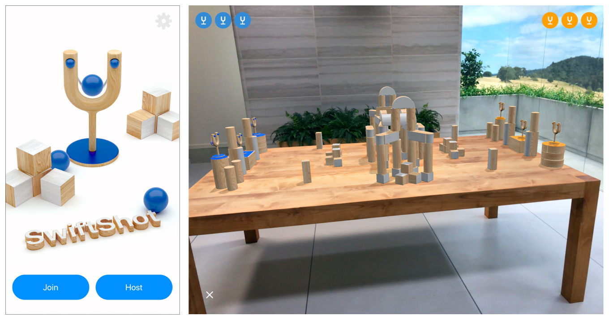

# SwiftShot: Creating a Game for Augmented Reality

See how Apple built the featured demo for WWDC18, and get tips for making your own multiplayer games using ARKit, SceneKit, and Swift.

## Overview

SwiftShot is an AR game for two to six players, featured in the [WWDC18 keynote][00]. Use this sample code project to experience it on your own device, see how it works, and build your own customized version of the game.

[00]:https://developer.apple.com/wwdc/

Tap the Host button to start a game for other nearby players, or the Join button to participate in a game started on another device. If you're hosting, the app asks you to find a flat surface (like a table) to place the game board on: Drag, rotate, and pinch to position and resize the board, then tap when you're ready to play, and the game board appears.

When the game board appears, you'll find a landscape of wooden blocks on the table, with three slingshots at each end. Move your device near a slingshot and touch the screen to grab it, then pull back and release to aim and fire the ball. Hit blocks with balls to knock them out of the way, and knock down all three of the other team's slingshots to win.

## Getting Started

Requires Xcode 10.0, iOS 12.0 and an iOS device with an A9 or later processor. ARKit is not supported in iOS Simulator.

## Designing Gameplay for AR

SwiftShot embraces augmented reality as a medium for engaging gameplay.

**Encourage player movement to make gameplay more immersive.** In SwiftShot, you may find that you can't get a good shot at an enemy slingshot because blocks are in the way. And you may find a structure of blocks that can't be easily knocked down from one angle. But you can move to other slingshots and work with your teammates to find the best angle for a winning play. 

**Don't encourage *too much* movement.** You have to aim carefully to fire a good shot, so you're less likely to bump into your teammates and send your device flying across the room.

**Foster social engagement.** Multiplayer AR games bring players together in the same space, giving them exciting new ways to have fun together. Using AR to watch a game as a spectator provides a different perspective and a new experience.

**Keep games short, but add fun through variation.** Getting up and waving your device around at arm's length can make for exciting gameplay, but it can also be tiring. SwiftShot keeps matches short, encouraging party-style gameplay where players can drop into and out of games often. But SwiftShot also provides several game board layouts and special effects so that each game can be different.

## Using Local Multipeer Networking and Sharing World Maps

SwiftShot uses the [MultipeerConnectivity][30] framework to establish a connection with other local players and send gameplay data between devices. When you start your own session, the player who starts the session creates an [`ARWorldMap`][31] containing ARKit's spatial understanding of the area around the game board. Other players joining the session receive a copy of the map and see a photo of the host's view of the table. Moving their device so they see a similar perspective helps ARKit process the received map and establish a shared frame of reference for the multiplayer game. 

For more details on setting up multiplayer AR sessions, see [Creating a Multiuser AR Experience][32]. For details on how this app implements Multipeer Connectivity, see the  [`GameBrowser`](x-source-tag://GameBrowser-MCNearbyServiceBrowserDelegate) and [`GameSession`](x-source-tag://GameSession-MCSessionDelegate) classes.

[30]:https://developer.apple.com/documentation/multipeerconnectivity
[31]:https://developer.apple.com/documentation/arkit/arworldmap
[32]:https://developer.apple.com/documentation/arkit/creating_a_multiuser_ar_experience

- Note: Using Multipeer Connectivity helps to ensure user privacy for the local space-mapping data that ARKit collects. Multipeer Connectivity transmits data directly between devices using peer-to-peer wireless networking. When you use the [`required`][33] encryption setting, it also protects against eavesdropping. 

[33]:https://developer.apple.com/documentation/multipeerconnectivity/mcencryptionpreference/required

## Synchronizing Gameplay Actions

To synchronize game events between players—like launching a ball from a slingshot—SwiftShot uses an *action queue* pattern:

- The [`GameManager`](x-source-tag://GameManager) class maintains a list of [`GameCommand`](x-source-tag://GameCommand) structures, each of which pairs a [`GameAction`](x-source-tag://GameAction) enum value describing the event with an identifier for the player responsible for that event.
- Whenever the local player performs an action that would trigger a game event (like touching the screen while near a slingshot), the game creates a corresponding [`GameAction`](x-source-tag://GameAction) and adds it to the end of the list. 
- At the same time, the game encodes that [`GameAction`](x-source-tag://GameAction) and sends it through the multipeer session to other players. Each player's [`GameSession`](x-source-tag://GameSession) decodes actions as they are received, adding them to the local [`GameManager`](x-source-tag://GameManager) instance's command queue.
- The [`GameManager`](x-source-tag://GameManager) class updates game state for each pass of the SceneKit rendering loop (at 60 frames per second). On each [`update`](x-source-tag://GameManager-update), it removes commands from the queue in the order they were added and applies the resulting effect for each in the game world (like launching a ball).

Defining the set of game events as a Swift enum brings multiple benefits. The enum can include additional information specific to each game action (like status for a slingshot grab or velocity for a ball launch) as an associated value for each enum case, which means you don't need to write code elsewhere determining which information is relevant for which action. By implementing the Swift [`Codable`][40] protocol on these enum types, actions can be easily serialized and deserialized for transmission over the local network.

[40]:https://developer.apple.com/documentation/swift/codable

## Solving Multiplayer Physics

[`SceneKit`][50] has a built-in physics engine that provides realistic physical behaviors for SwiftShot.  SceneKit simulates physics on only one device, so SwiftShot needs to ensure that all players in a session see the same physics results, while still providing realistic smooth animation. SwiftShot supports all ARKit-capable iOS devices and unreliable networking scenarios, so it can't guarantee that all devices in a session can synchronize at 60 frames per second.

SwiftShot uses two techniques to solve these problems:

**Each peer in a session runs its own local physics simulation, but synchronizes physics results.** To ensure that gameplay-relevant physics results are consistent for all peers, the game designates the player who started the game as the source of truth. The peer in that "server" role continually sends physics state information to all other peers, who update their local physics simulations accordingly. The physics server doesn't encode and transmit the entire state of the SceneKit physics simulation, however—it sends updates only for bodies that are relevant to gameplay and whose state has changed since the last update. For implementation details, see the [`PhysicsSyncSceneData`](x-source-tag://PhysicsSyncSceneData) class in the sample code.

**Domain-specific data compression minimizes the bandwidth cost of physics synchronization.** To transmit physics state information, the server encodes only the minimal information needed for accurate synchronization: position, orientation, velocity, and angular velocity, as well as a Boolean flag indicating whether the body should be treated as in motion or at rest. To send this information efficiently between devices, the [`PhysicsNodeData`](x-source-tag://PhysicsNodeData) and [`PhysicsPoolNodeData`](x-source-tag://PhysicsPoolNodeData) types encode it to a minimal binary representation. For example:

- Position is a three-component vector of 32-bit float values (96 bits total), but the game is constrained to a space 80 units wide, tall, and deep. Applying this constraint provides for encoding position in only 48 bits (16 bits per component).
- Orientation can be expressed as a unit quaternion of always-positive magnitude, which in turn can be written as a four-component vector. Additionally, one component of a unit quaternion is always dependent on the other three, and those components' values are always in the range from `-1/sqrt(2)` to `1/sqrt(2)`. Applying these constraints provides for encoding orientation in 38 bits (2 bits to identify the dependent component, and 12 bits each for the other three components).

To encode and decode structures with this compact packing of bits, SwiftShot defines a [`BitStreamCodable`](x-source-tag://BitStreamCodable) protocol, extending the pattern of the Swift [`Codable`][40] protocol and providing a way to combine bit-stream-encoded types with other Swift [`Codable`][40] types in the same data stream. 

- Note: SwiftShot's bit-stream encoding is purpose-built for minimal data size, so it omits features of a general-purpose encoder such as resilience to schema change. 

The [`GameSession`](x-source-tag://GameSession) class sends and receives physics synchronization data in addition to game actions. Physics data synchronization occurs outside the queue used for game actions, so that each peer's physics world is updated to match the server's at the earliest opportunity.

[50]:https://developer.apple.com/documentation/scenekit
